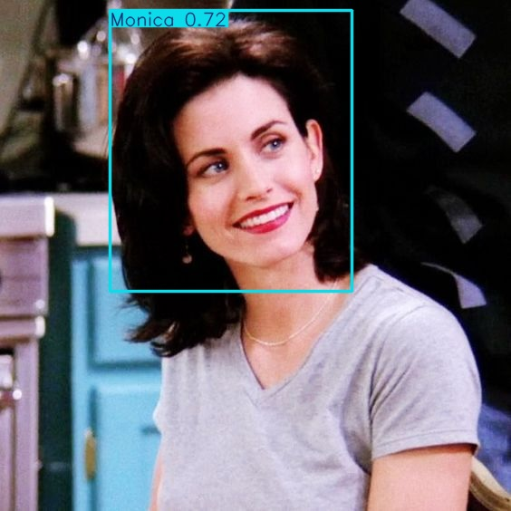
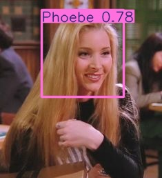
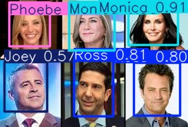
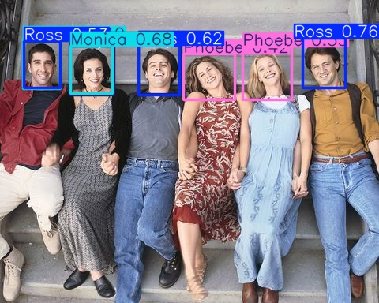

<h1 align="center">Reconhecimento Friends</h1>

Treinamento de uma rede YOLO v11 para reconhecimento dos personagens do seriado Friends.
O dataset é pequeno, apenas para demonstrar o funcionamento do treinamento da rede. As imagens estão divididas em treino e validação e todas as imagens estão marcadas, identificando a face dos personagens.

O módulo ReconFriends.py é usado para treinar o modelo para reconhecer os 6 personagens, Já o módulo InferenciaFriends.py usa o modelo treinado para reconhecer os personagens. O dataset para treinamente tem a maior parte dos arquivos com apenas um personagem na imagem, isso prejudica a inferência quando vários personagens aparecem na mesma imagem. Alguns resultados podem ser conferidos a seguir:

  

  
  
  

##Observação:
O treinamento foi realizado num MacBookAir com processador M2, 8 Gb de RAM, S.O. Sequoia 15.7.2 e demorou cerca de 12 minutos para executar as 100 épocas. Foi habilitado o uso de GPU, com a opção device='mps'. Para executar o modelo é necessário instalar a biblioteca ultralytics (pip install ultralytics)
